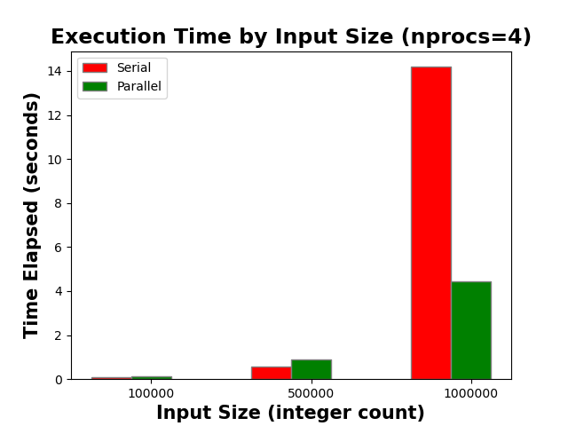
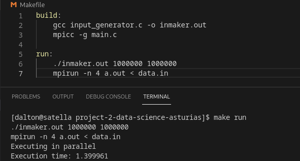
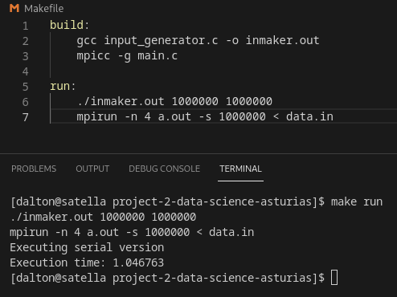
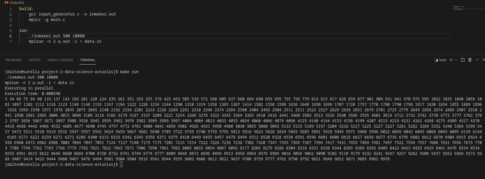

# Parallel Radix Sort LSD

A Radix Sort of the least significant digit (LSD) over MPI.

## Group members

Dalton Caron dpcaron@csu.fullerton.edu

## Description

This project parallelizes radix sort LSD so that the input can be split upon multiple processes and sorted in parallel. Minimal modification is made to the sorting algorithm as it just executes on the input provided to each process. The tricky part is the data redistribution step. The processes must redistribute the data such that each process has data sorted by the digits place in question in terms of the base such that the next step of sorting occurs in order between the processes. The data distribution problem has been solved by distributing the sorting memory globally and then having each process select elements out of the input for the next round of sorting. Despite the overhead associated with the data distribution steps, performance increases can be observed on large inputs. Consider the following graph.

<div style="text-align: center">
    
</div>

## Input

Input to this program is generated by the inmaker.out executable. The inmaker.out executable takes as input two integers: the amount of integers to generate and the maximum value permitted to be generated. 

```bash
./inmaker.out [AMOUNT_TO_GENERATE] [MAX_VALUE_PERMITTED]
```

The results of inmaker.out are written to a file `data.in`. This file can then be piped as input to the `a.out` file that contains the executable for the parallel radix sort program.

The parallel radix sort program takes as input an integer to specify how long the input array will be and then the input array of integers separated by whitespace. It is easier to write the input to a text file and pipe it into the program.

```bash
mpirun -n [nprocs] a.out -i < data.in
```

The `a.out` executable supports a few options. `-b [number]` may be provided to specify what base to use for the radix sort. Base 2 is used by default. `-i` is a boolean flag that enables the printing of the sorted array output. `-s number` sets how large the input array must be to be executed in parallel. Small arrays should be executed serially as they will not get a performance gain. 

## Output

The output contains timing information along with the sorted array if the `-i` flag is provided. Output is omitted as it can be very large and is just a sorted list of integers. 

## Easy Run

To build and run the program with preset settings, use the following commands.

```
make
make run
```

## Psuedocode

```fortran
PROCEDURE PARALLEL_RADIX_SORT_LSD
BEGIN
    READ INPUT ARRAY a
    LENGTH OF a IS a_count
    MAXIMUM VALUE IN a IS max
    DISTRIBUTE a AMONG n PROCESSES SUCH THAT l IS A LOCAL PARTITION OF LENGTH l_count
    THIS_PROCESS_SORT(a, a_count, l, l_count, max)
    PRINT_ARRAY(a)
END

PROCEDURE THIS_PROCESS_SORT(a, a_count, l, l_count, max)
BEGIN
    1 IS digitplace
    ARRAY OF LENGTH l_count IS r
    ARRAY OF LENGTH BASE IS count WITH ELEMENTS INITIALIZED TO 0

    WHILE max / digitplace > 0 DO
        FOR i = 0 TO l_count - 1 DO
            count[(l[i] / digitplace) % BASE] += 1
        END FOR

        FOR i = 1 TO BASE - 1 DO
            count[i] += count[i - 1]
        END FOR

        FOR i = l_count - 1 TO 0 DO
            r[count[(l[i] / digitplace) % BASE] - 1] = l[i]
            count[(l[i] / digitplace) % BASE] -= 1
        END FOR 

        FOR i = 0 TO l_count DO
            l[i] = r[i]
        END FOR

        MPI_Allgather(l, l_count, INT, a, a_count, INT, MPI_COMM_WORLD)

        0 IS current_process
        ARRAY OF LENGTH nprocs IS capacities
        0 IS local_count
        
        FOR base = 0 TO BASE - 1 DO
            FOR pos = 0 TO a_count - 1 DO
                IF ((a[pos] / digitplace) % BASE) == base THEN
                    capacities[current_process] -= 1

                    IF rank == current_process THEN
                        l[local_count] = a[pos]
                        local_count += 1
                    END IF

                    IF capacities[current_process] == 0 THEN
                        current_process += 1
                    END IF
                END IF
            END FOR
        END FOR
    END WHILE
END
```

## Screenshots

<div style="center">
    <br>
    
    <br>
    
    <br>
    
</div>